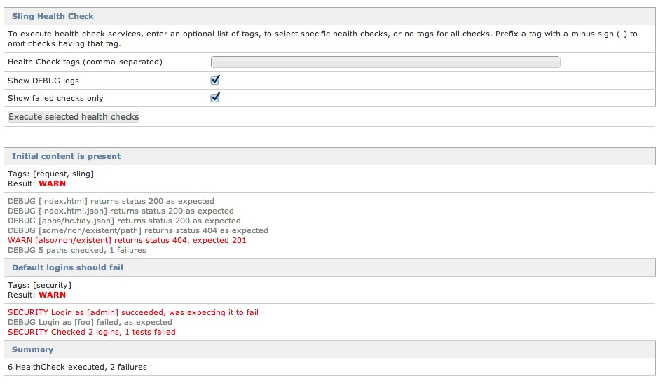

Title: Sling Health Check Tools

Based on simple `HealthCheck` OSGi services, the Sling Health Check Tools ("hc" in short form) are used to 
check the health of live Sling systems, based on inputs like JMX MBean attribute values, OSGi framework 
information, Sling requests status, etc.

Health checks are easily extensible either by configuring the supplied default `HealthCheck` services, or 
by implementing your own `HealthCheck` services to cater for project specific requirements.

However for simple setups, the out of the box health checks are often sufficient. [Executing Health Checks](#executing-health-checks)
is a good starting point to run existing checks and to get familiar with how health checks work.

See also:

* Source code at  [http://svn.apache.org/repos/asf/sling/trunk/bundles/extensions/healthcheck](http://svn.apache.org/repos/asf/sling/trunk/bundles/extensions/healthcheck)
* adaptTo slides about Health Checks: [Introduction](http://www.slideshare.net/bdelacretaz/slinghc-bdelacretazadaptto2013) and [Health Check Executor](https://adapt.to/content/dam/adaptto/production/presentations/2014/adaptTo2014-Sling-Health-Checks-New-And-Noteworthy-Georg-Henzler.pdf/_jcr_content/renditions/original.media_file.download_attachment.file/adaptTo2014-Sling-Health-Checks-New-And-Noteworthy-Georg-Henzler.pdf)

## Use cases
Generally health checks have two high level use cases:

* Operations teams checking sling instances for their internal state manually
* Load balancers can query the health of a sling instance and decide to take it out or back into the list of used backends automatically

The strength of Health Checks are to surface internal Sling state for external use:

* Verify that performance counters are in range
* Run smoke tests at system startup 
* Check that all OSGi bundles are up and running
* Check that demo content has been removed from a production system
* Check that demo accounts are disabled
* Ping external systems and raise alarms if they are down

The health check subsystem uses tags to select which health checks to execute so you can for example execute just the _performance_ or _security_ health 
checks once they are configured with the corresponding tags.

The out of the box health check services also allow for using them as JMX aggregators and processors, which take JMX
attribute values as input and make the results accessible via JMX MBeans.

## What's a `HealthCheck` ?

A `HealthCheck` is just an OSGi service that returns a `Result`.

    public interface HealthCheck {
        
        /** Execute this health check and return a {@link Result} 
         *  This is meant to execute quickly, access to external
         *  systems, for example, should be managed asynchronously.
         */
        public Result execute();
    }
    
Where `Result` is a simple immutable class that provides a `Status` (OK, WARN, CRITICAL etc.) and one or more log-like messages that
can provide more info about what, if anything, went wrong.

    public class Result implements Iterable <ResultLog.Entry> {

        public boolean isOk() {
            return getStatus().equals(Status.OK);
        }
    
        public Status getStatus() {
            return resultLog.getAggregateStatus();
        }
    
        @Override
        public Iterator<ResultLog.Entry> iterator() {
            return resultLog.iterator();
        }
        
        ... details omitted
    } 

### SlingHealthCheck annotation
The `SlingHealthCheck` annotation makes it easier to specify the required `HealthCheck` service properties.

Here's an example from the `samples` module - see the `annotations` module for more details.

    @SlingHealthCheck(
        name="Annotated Health Check Sample", 
        mbeanName="annotatedHC",
        description="Sample Health Check defined by a java annotation",
        tags={"sample","annotation"})
    
    public class AnnotatedHealthCheckSample implements HealthCheck {

        @Override
        public Result execute() {
            ...health check code
        }
    }

## Executing Health Checks

Health Checks can be executed via a [webconsole plugin](#webconsole-plugin), the [health check servlet](#health-check-servlet) or via [JMX](#jmx-access-to-health-checks). `HealthCheck` services can be selected for execution based on their `hc.tags` multi-value service property. 

The `HealthCheckFilter` utility accepts positive and negative tag parameters, so that `-security,sling` 
selects all `HealthCheck` having the `sling` tag but not the `security` tag, for example.

For advanced use cases it is also possible to use the API directly by using the interface `org.apache.sling.hc.api.execution.HealthCheckExecutor`.

## Health Check bundles
The Health Check subsystem consists of the following bundles:

* The only required bundles are `org.apache.sling.hc.api` which provides the API and `org.apache.sling.hc.core` which provides some utility classes and some generally useful `HealthCheck` services (e.g. the health check executor)
* `org.apache.sling.hc.support` provides more Sling-specific `HealthCheck` services.
* `org.apache.sling.hc.webconsole` provides the Webconsole plugin described below.
* `org.apache.sling.junit.healthcheck` provides a `HealthCheck` service that executes JUnit tests in the server-side OSGi context.
* `org.apache.sling.hc.samples` provides sample OSGi configurations and `HealthCheck` services. The sample configurations are provided as Sling content, so the Sling Installer is required to activate them.
* `org.apache.sling.hc.junit.bridge` makes selected Health Checks available as server-side JUnit tests. See below for more info. 

## Out-of-the-box `HealthCheck` services

The following default `HealthCheck` services are provided by the `org.apache.sling.hc.core` bundle: 

The `org.apache.sling.hc.samples` bundle provides OSGi configurations that demonstrate them.

 * `JmxAttributeHealthCheck` checks the value of a single JMX attribute and supports ranges like _between 12 and 42_.  
 * `ScriptableHealthCheck` evaluates an expression written in any scripting language that Sling supports, and provides bindings to access JMX attributes. 
 * `CompositeHealthCheck` executes a set of `HealthCheck` selected by tags, useful for creating higher-level checks.

A few more Sling-specific ones are provided by the `org.apache.sling.hc.support` bundle:
 
 * `SlingRequestStatusHealthCheck` checks the HTTP status of Sling requests.  
 * `DefaultLoginsHealthCheck` can be used to verify that the default Sling logins fail.  
 * `ThreadUsageHealthCheck` can be used to monitor for deadlocks using JRE ThreadMXBean (see [SLING-6698](https://issues.apache.org/jira/browse/SLING-6698) )
 
A bridge to server-side OSGi-aware JUnit tests is provided by the `JUnitHealthCheck`, from 
the `org.apache.sling.junit.healthcheck` bundle.
 
The `org.apache.sling.hc.samples` bundle provides an example `OsgiScriptBindingsProvider` for the default `ScriptableHealthCheck`,
which provides OSGi-related information to health check script expressions.

## Configuring Health Checks
`HealthCheck` services are created via OSGi configurations. Generic health check service properties are interpreted by the health check executor service. Custom health check service properties can be used by the health check implementation itself to configure its behaviour.

The following generic Health Check properties may be used for all checks:

Property    | Type     | Description  
----------- | -------- | ------------
hc.name     | String   | The name of the health check as shown in UI
hc.tags     | String[] | List of tags: Both Felix Console Plugin and Health Check servlet support selecting relevant checks by providing a list of tags
hc.mbean.name | String | Makes the HC result available via given MBean name. If not provided no MBean is created for that `HealthCheck`
hc.async.cronExpression | String | Used to schedule the execution of a `HealthCheck` at regular intervals, using a cron expression as specified by the [Sling Scheduler]({{ refs.scheduler-service-commons-scheduler.path }}) module. 
hc.resultCacheTtlInMs | Long | Overrides the global default TTL as configured in health check executor for health check responses (since v1.2.6 of core)

All service properties are optional.

As an example, here's a `ScriptableHealthCheck` configuration provided by the `org.apache.sling.hc.samples` bundle:

    Factory PID = org.apache.sling.hc.ScriptableHealthCheck
    "hc.name" : "LoadedClassCount and ManagementSpecVersion are in range" 
    "hc.mbean.name" : "LoadedClassCount and ManagementSpecVersion"
    "hc.tags" : [jvm, script]
    "expression" : "jmx.attribute('java.lang:type=ClassLoading', 'LoadedClassCount') > 10 &&  jmx.attribute('java.lang:type=Runtime', 'ManagementSpecVersion') > 1" 
    "language.extension" : "ecma" 
  
The service properties starting with the `hc.` prefix in this example should be provided by all `HealthCheck` services. 

## Configuring the Health Check Executor
The health check executor can **optionally** be configured via service PID `org.apache.sling.hc.core.impl.executor.HealthCheckExecutorImpl`:

Property    | Type     | Default | Description  
----------- | -------- | ------ | ------------
timeoutInMs     | Long   | 2000ms | Timeout in ms until a check is marked as timed out
longRunningFutureThresholdForCriticalMs | Long | 300000ms = 5min | Threshold in ms until a check is marked as 'exceedingly' timed out and will marked CRITICAL instead of WARN only
resultCacheTtlInMs | Long | 2000ms | Result Cache time to live - results will be cached for the given time

## Webconsole plugin
If the `org.apache.sling.hc.webconsole` bundle is active, a webconsole plugin 
at `/system/console/healthcheck` allows for executing health checks, optionally selected
based on their tags (positive and negative selection, see the `HealthCheckFilter` mention above).

The DEBUG logs of health checks can optionally be displayed, and an option allows for showing only health checks that have a non-OK status.

The screenshot below shows an example, as of svn revision 1513462.

## JMX access to health checks
If the `org.apache.sling.hc.jmx` bundle is active, a JMX MBean is created for each `HealthCheck` which has the 
service property `hc.mbean.name` service property set. All health check MBeans are registered in the 
domain `org.apache.sling.healthcheck` with a type of `HealthCheck`.

The MBean gives access to the `Result` and the log, as shown on the screenshot below.   

See the example configurations of the `org.apache.sling.hc.samples` for more details.

## Health Check Servlet
Starting with version 1.2.4 of the `org.apache.sling.hc.core` bundle, a flexible Health Checks execution servlet is available. It provides
similar features to the Web Console plugin described above, with output in HTML, JSON (plain or jsonp) and TXT (concise or verbose) formats (see HTML format rendering page for more documentation).

The Health Checks Servlet is disabled by default, to enable it create an OSGi configuration like

    PID = org.apache.sling.hc.core.impl.servlet.HealthCheckExecutorServlet
    servletPath = /system/health

which specifies the servlet's base path. That URL then returns an HTML page, by default with the results of all active health checks and
with instructions at the end of the page about URL parameters which can be used to select specific Health Checks and control their execution and output format.

Note that by design **the Health Checks Servlet doesn't do any access control by itself** to ensure it can detect unhealthy states of the authentication itself. Make sure the configured path is only accessible to relevant infrastructure and operations people. Usually all `/system/*` paths are only accessible from a local network and not routed to the Internet.

## Health Checks as server-side JUnit tests
The `org.apache.sling.hc.junit.bridge` bundle makes selected Health Checks available as server-side JUnit tests. 

It requires the `org.apache.sling.junit.core bundle` which provides the server-side JUnit tests infrastructure.

The idea is to implement the smoke tests of your system, for example, as health checks. You can then run them
as part of integration testing, using the  [Sling Testing Tools]({{ refs.sling-testing-tools.path }})  
remote testing utilities, and also as plain Health Checks for monitoring or troubleshooting Sling instances.

To use this module, configure sets of tags at `/system/console/configMgr/org.apache.sling.hc.junitbridge.HealthCheckTestsProvider`
using the standard `includeThisTag,-omitThatTag` syntax, and JUnit tests will be available at /system/sling/junit/HealthChecks.html 
to run the corresponding Health Checks.

To run the Health Check tests at build time, see the [testing/samples/integration-tests](http://svn.apache.org/repos/asf/sling/trunk/testing/samples/integration-tests)
sample module.
  

