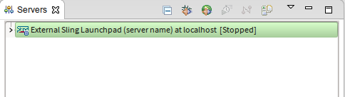
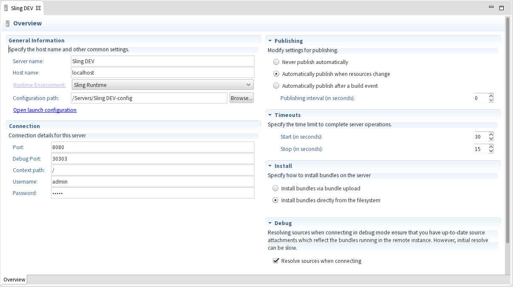
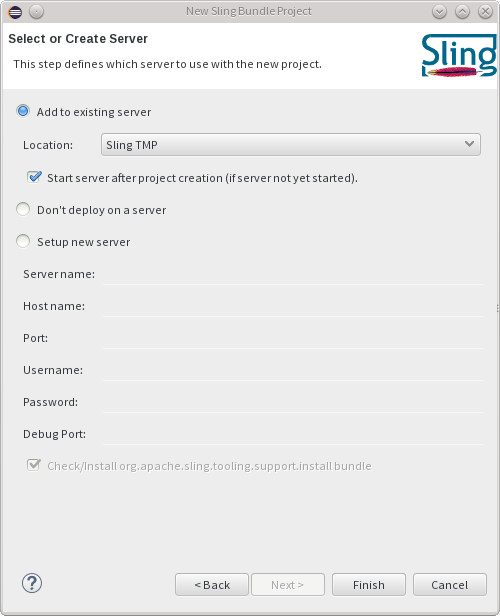
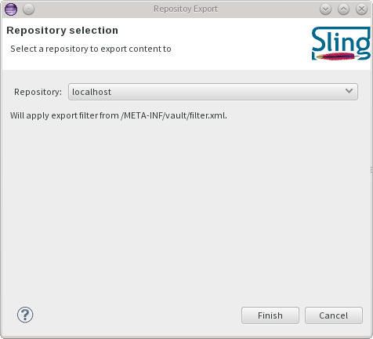

title=TODO title for ide-tooling.md 
date=1900-01-01
type=post
tags=blog
status=published
~~~~~~
Title: Sling IDE tooling for Eclipse User Guide

[TOC]

## Installation

### Prerequisites

The Sling IDE tooling is known to work on Eclipse versions starting with Kepler. There is a hard dependency on the faceted project framework, which is included in the 'Eclipse IDE for Java EE Developers' package. If you're running a different package, you can always install it from the main Eclipse update site.

There is an optional feature which relies on m2eclipse. For now it only provides project creation wizards, so if you don't use Maven you don't have to install it.

### Update site installation

The links to the latest update site, including a permanent URL which stays up to date, are listed on the [Download page, IDE tooling section](/downloads.cgi#ide-tooling). There are also zipped update sites available from download for the latest version.

### Building from source

The update sites are provided as a convenience for users that do not wish to build the project themselves. Building the project only requires a recent Maven installation. The project can be checked out, either [from trunk for the latest development version](https://svn.apache.org/repos/asf/sling/trunk/tooling/ide/) or [from a tag for released versions](https://svn.apache.org/repos/asf/sling/tags/), where the tags names have the format sling-ide-tooling-$VERSION. Once you have obtained the source code, it is enough to run

	mvn package

and you will find a p2 update site in p2update/target/repository .

## Overall concepts

The Sling IDE tooling is centered around the Server and Module concepts. A Server is an instance of a Sling launchpad - or derivatives such as Adobe CQ - on which you deploy your content. A Module is a collection of resources grouped into a single Eclipse project which can be deployed onto one or multiple Servers.

The tooling supports content and bundle modules. Content modules typically hold Sling scripts - like JSP and ESP files, client-side resources like CSS and JSS file, but also arbitrary repository content. Content modules support support setting JCR properties for nodes other than nodes and files, based on the FileVault serialization format. You can read mode about FileVault at the [Apache Jackkrabit FileVault docs](https://jackrabbit.apache.org/filevault/). Bundle modules represent a single OSGi bundle.

### Server definition

To create a new Sling launchpad server you will need to start a Sling launchpad outside of Eclipse. We do not yet support starting Sling Launchpad instances from Eclipse.

To kick off, create a new Sling Server using the File -> New -> Other... menu entry.

In the resulting wizard, select the Sling Server (External) entry and enter the host name.

Once that is done, press finish.

## Server configuration

The server will appear in the servers view. You can double-click on it to review the settings which were automatically provided.

There are a couple of important settings in the server definition page:

* port: used for connecting to the server
* username, password, context path: controls the connection details to the Sling instance.
* debug port: used for connecting in debug mode

For working with OSGi bundles there are two options as to how they are installed to the Sling launchpad instance:

* Install via bundle upload: this is the normal way which creates a bundle (jar) locally and uploads that to the server. It thus works locally or remotely.
* Install directly from local directory: this is a faster bundle redeployment variant which does not build a bundle (jar) locally but instead instructs the server to install a bundle based on an exploded directory. (See [SLING-3019](https://issues.apache.org/jira/browse/SLING-3019) for details). This requires a special support bundle to be present on the server. If it is not present, you can install it using the hyperlink from the Install section. Note that this only works locally since the server will directly read from the exploded directory.

You can now connect to the server.

## Content sync

Content projects are required to have at least

* a jcr_root directory, which contains the serialized content of the repository
* a META-INF/vault/filter.xml file, which contains the workspace filter definition

All changes performed in the local workspace are synchronized to the repository, given that they are included in the workspace filter definition.

### Creating a new content project

Creating a new Sling content project is easily done by using the new Sling Content Project Wizard. To kick off, start by selected File -> New -> Project and select Sling Content Project under the Sling category.

You will then be asked to name the project and select its location.

Finally, you can select whether to add the project to an existing server, create a new one, or leave it undeployed.

Once you press finish, the project will be created and deployed to the server if needed.

Note that deploying a project on the server publishes all the resources from the project if the server is started. If the server is stopped, you need to manually publish the changes after startup.

### Converting existing projects

#### Automatic conversion

Maven projects configured using the `com.day.jcr.vault:content-package-maven-plugin` are now automatically configured as content projects, removing the need to manually add the needed facets after importing them into Eclipse for the first time.

The following pom properties can be used to tweak how the project is configured

| Property name | Effect |
|--|--|
| `sling.ide.m2e.contentpackage.active` | When set to `false`, the configuration is disabled |
| `sling.ide.m2e.contentpackage.javaFacetVersion` | Controls the version of the Java Facet which is added to the project, e.g. `8` |
| `sling.ide.m2e.contentpackage.webFacetVersion` | Controls the version of the Web Facet which is added to the project, e.g. `3.0` |

#### Manual conversion

To mark a project as being a Sling content module, click it in the Project Explorer and Select Configure -> Convert to Sling Content Project... . A dialog will pop up and will ask you to confirm the inferred location of the jcr_root directory. You can also change this from the project properties, the Sling page.

### Content navigator

In the Project Explorer view there is an additional 'jcr_root' contribution to the project. It is denoted by a folder icon with a small web overlay. This contribution provides a logical view over the repository content, taking into account JCR metadata. As such, .content.xml files will be folded into the corresponding node.

Node properties can be edited in a distinct JCR properties view.

### filter.xml - workspace filter definition

A content project does not synchronize all its contents to the workspace. Instead, it looks for a filter.xml file which defines which content is included in synchronization operations. More information about the filter.xml file format and semantics can be found at [FileVault docs - Workspace Filter](https://jackrabbit.apache.org/filevault/filter.html).

### Deploying projects on the server

To deploy a project on the server, open the Servers view and use the Add and Remove... dialog to add one or more modules.

After content projects are deployed, each change will cause the changed resources to be updated in the repository.

### Manual content sync

It is possible to manually import/export content from/to the repository. The precondition is that the content project must be associated with a started Sling launchpad server. The actions are available on the project root, or on any child resource under the jcr_root folder.

The export wizard is available under the Sling -> Export Content ... action.

The import wizard is available under the Sling -> Import Content ... action.

## Bundle sync

The only requirement for bundle projects is that they are Java projects which generate an exploded OSGi bundle in their output directory. That requires at least a valid OSGi Manifest located in META-INF/MANIFEST.MF, but typically one of more Java classes. Other auxiliary files, such as Declarative Service descriptors, must also be placed under the project's output directory.

### Creating a new bundle project

Creating a new Sling bundle project is easily done by using the new Sling Bundle Project Wizard. This wizard is only available when the Maven-based integration is installed. To kick off, start by selected File -> New -> Project and select Sling Bundle Project under the Sling category.

The next page allows you to select the archetype to use. It's recommended to select the latest version of the archetype.

You will be asked to configure the archetype's properties.

Finally, you can select whether to add the project to an existing server, create a new one, or leave it undeployed.

Once you press finish, the project will be created and deployed to the server if needed.

### Converting existing projects

To mark a project as being a Sling bundle module, right click it in the Project Explorer and Select Configure -> Convert to Sling Bundle Project... . A dialog will appear with all the candidate Sling bundle project from the workspace so that you can quickly select multiple projects.

### Deploying projects on the server

To deploy a project on the server, open the Servers view and use the Add and Remove... dialog to add one or more modules.

After OSGi bundle projects are deployed, each change will cause the bundle to be redeployed on the server.

## HTL support

_Available with Sling IDE Tooling for Eclipse 1.1 or newer_

Support for HTL (formerly known as Sightly) has been added through an additional, optional, feature named _Sling IDE Tools - Sightly Integration_.

This feature provides the following enhancements:

* auto-completion of tag named and attributes names in the HTML Editor
* wizards for creating new HTL scripts and Use Classes ( Java and Javascript )
* HTL-aware validation for HTML files

These enhancements are enabled once the HTL facet is added to a project. This is done automatically when converting a project to content project, but can also be done manually via the project properties, under the _Project Facets_ page.

## Debugging

_Available with Sling IDE Tooling for Eclipse 1.1 or newer_

When first connecting to a Sling instance in debug mode, the IDE tooling tries to bind all the sources associated with the bundles deployed on the server and retrieves the associated source artifacts using Maven. Therefore, the debug classpath is as close as possible to sources used to build the bundles deployed on the server.

Since a first source bundle resolution can potentially take a long time, this behaviour can be disabled from the server configuration page.

## Launchpad project support

_Available with Sling IDE Tooling for Eclipse 1.2 or newer_

Maven projects configured with the `slingstart-maven-plugin` will automatically have their models directory configured as a top-level entry in the project tree. By default, the models directory is `src/main/provisioning`. This contribution is only available in the _Project Explorer_ view.

The configuration is done automatically on import, and you can also do it manually by right-clicking on the project and then selecting _Maven_ → _Update Project..._.

## Troubleshooting

### Gathering debug information

All operations that are performed on the Sling launchpad are logged in the Sling console. To view these operations, open the Eclipse console view and select Open Console -> Sling Console.

Additional information can be obtained by enabling the Eclipse platform tracing facility. To do so, open the Eclipse preferences and navigate to General -> Tracing. Make sure that 'Enable tracing' is checked and all options under 'Sling IDE Tooling' are enabled.

### Why do I get an error about "No DS descriptor found at..."?

Bundle deployment assumes that the OSGi bundle is packaged into the project's output directory. This includes:

* the manifest
* compiled class files
* resources
* Declarative Services descriptors

One often-occuring situation is that a Maven project using the maven-scr-plugin generates the descriptors outside of target/classes, typically in target/scr-plugin-generated. To fix this, make sure that you're using the maven-scr-plugin 1.15.0 or newer and that you have not set a custom outputDirectory.

### How do I fix the error "Missing m2e incremental build support for generating the bundle manifest, component descriptions and metatype resources"?

For further information on how to fix and configure the according maven plugins look at [Incremental Builds in Sling IDE tooling for Eclipse]({{ refs.ide-tooling-incremental-build.path }}).

## Known issues

The content sync implementation tries to mimic the FileVault semantics as closely as possible. However, it is possible that some more exotic content structures will not be handled properly. Some of the problems we're are of are:

* [SLING-3591 - Unable to delete all nodes of a full coverage aggregate](https://issues.apache.org/jira/browse/SLING-3591) . The workaround is to manually delete the child nodes .
* [SLING-3644 - Improve handling of binary properties outside nt:file file nodes](https://issues.apache.org/jira/browse/SLING-3644) . Currently there is no workaround, but in practice this is not an often-encountered situation.
